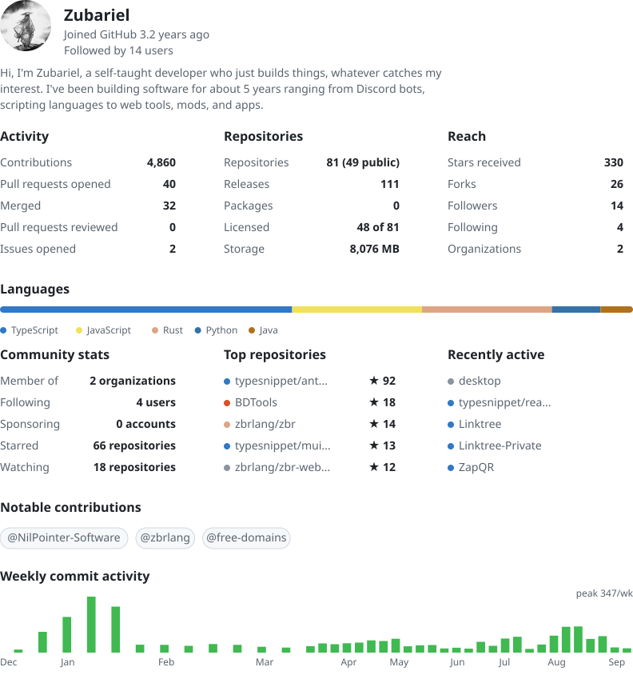

<a href="https://zubs.me/">
  <picture>
    <source
      srcset="metrics-dark.svg"
      media="(prefers-color-scheme: dark)"
    />
    <source
      srcset="metrics-light.svg"
      media="(prefers-color-scheme: light)"
    />
    
  </picture>
</a>
